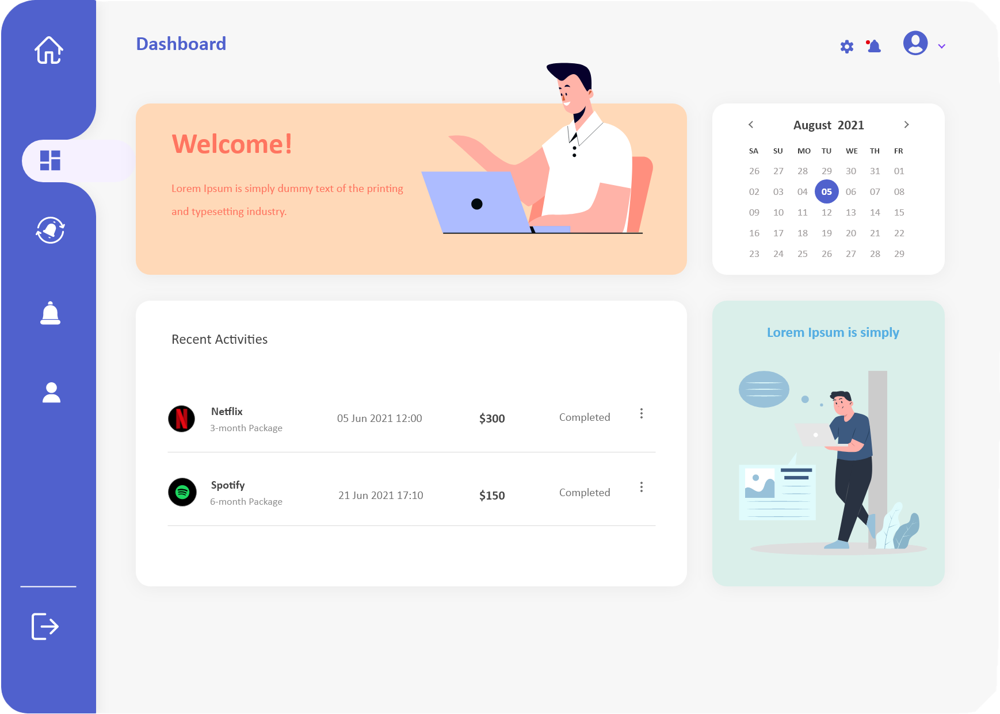
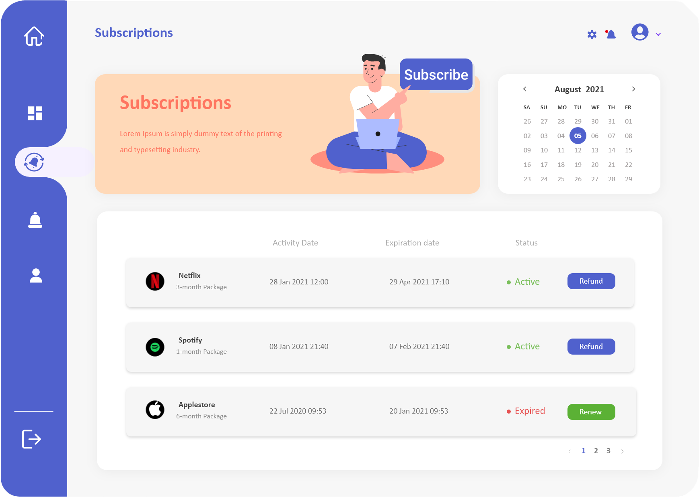
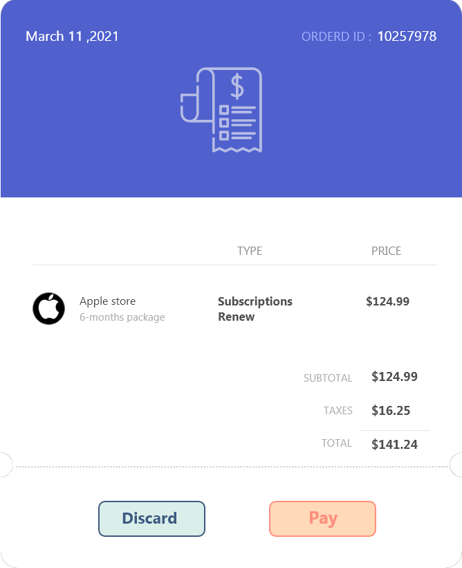
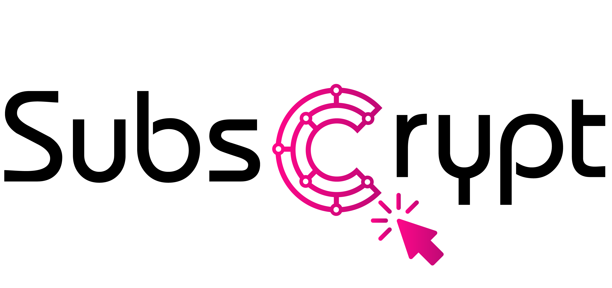

# Design of UI
The disign process has been done by Adobe XD app, the design of invoice pop-up is done and also the mock-ups of our SubsCrypt dashboard is also finished. For the next phase we will implement this design using React and TypeScript. Here You can see the png output of the designs and also you can download each xd file separately.

### Dashboard Design 
[Download xd file](https://github.com/oxydev/SubsCrypt-docs/raw/master/images/Dashboard.xd)

### Subscriptions Design 
[Download xd file](https://github.com/oxydev/SubsCrypt-docs/blob/master/images/Subscriptions.xd)

### Pop-up Design 
[Download xd file](https://github.com/oxydev/SubsCrypt-docs/raw/master/images/popup.xd)

### Logo Design 
[Download png file](https://raw.githubusercontent.com/oxydev/SubsCrypt-docs/master/images/logo2.png)

